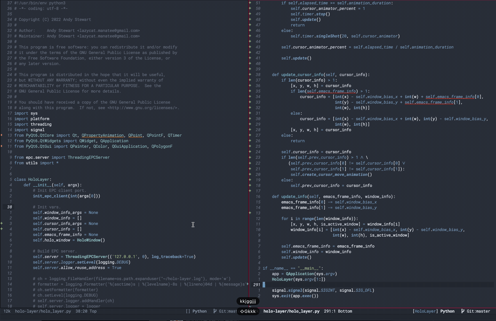

English | [简体中文](./README.zh-CN.md)

## Introduction
HoloLayer is a multimedia layer plugin specifically designed for Emacs. It is developed based on PyQt, aiming to significantly enhance the visual experience of Emacs. The plugin provides a series of visual enhancement features, including modern window borders, window jump prompts, cursor animations, window screenshots, transparent floating terminals, and real-time dictionaries, etc. These features not only make the Emacs interface look more modern, but also ensure that the performance of Emacs will not be affected.

## Installation
1. Install Emacs 28 or above (For MacOS, please use Emacs without fullscreen)
2. Install Python dependencies: `pip3 install epc sexpdata six inflect PyQt6 PyQt6-Qt6 PyQt6-sip` (For ArchLinux, please use pacman to install PyQt6)
3. Use `git clone` to download this repository, and replace the load-path path in the configuration below
4. Add the following code to your configuration file ~/.emacs:

```elisp
(add-to-list 'load-path "<path-to-holo-layer>")
(require 'holo-layer)
(holo-layer-enable)
```

Note: If you are using Conda or other virtual environments, please first set `holo-layer-python-command` to the corresponding Python path.

## Demo

### Jelly Cursor Animation
<p align="center">
  
</p>


## Options
* holo-layer-enable-cursor-animation: Whether to enable the animation of the jelly cursor, it is off by default
* holo-layer-enable-place-info: Display information at the cursor in the upper right corner of the screen, such as the translation of the word at the cursor, it is off by default
* holo-layer-enable-window-border: Display window border, it is off by default
* holo-layer-hide-mode-line: Enable this option to hide the mode-line, it is off by default
* holo-layer-active-window-color: The border color of the active window, only displayed when there are more than two windows
* holo-layer-inactive-window-color: The border color of the inactive window, only displayed when there are more than two windows
* holo-layer-cursor-color: The color of the jelly cursor, by default it matches the background color of the Emacs cursor
* holo-layer-cursor-alpha: The Alpha transparency of the jelly cursor, the default is 200, completely transparent is 0, opaque is 255
* holo-layer-cursor-animation-interval: The interval time of the jelly cursor animation, the default is 10ms, don't worry about the time interval, because the animation effect is drawn with PyQt multithreading, it does not affect Emacs performance
* holo-layer-cursor-block-commands: If you don't want to display cursor animation in some cases, you can add the command string to this list, for example, after `self-insert-command` is added to the list, inserting characters will not produce animation
* holo-layer-place-info-text-color: The text color of the information at the cursor, the default is the foreground color of `default`
* holo-layer-place-info-background-color: The background color of the information at the cursor, the default is the background color of `default`
* holo-layer-place-info-font-size: The font size of the information at the cursor, the default is 18
* holo-layer-window-number-color: The color of the window jump number, use the `holo-layer-jump-to-window` command to jump windows
* holo-layer-window-number-font-size: The font size of the window jump number, the default is 40

## Feedback Issues

For other issues, please use the command `emacs -q` and only add holo-layer configuration for a comparison test. If `emacs -q` can work normally, please check your personal configuration file.

If the problem still exists under the `emacs -q` environment, please go [here](https://github.com/manateelazycat/holo-layer/issues/new) to provide feedback, and attach the content of the `*holo-layer*` window to submit an issue to us. There are many clues in there that can help us troubleshoot the problem.

If you encounter a crash, please use the following method to collect crash information:
1. First install gdb and turn on the option `(setq holo-layer-enable-debug t)`
2. Use the command `holo-layer-stop-process` to stop the holo-layer process
3. Reopen holo-layer, and send the content of `*holo-layer*` at the next crash

## Contributors
<a href = "https://github.com/manateelazycat/holo-layer/graphs/contributors">
  
</a>
